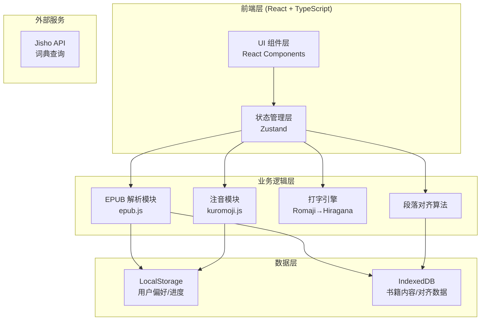

# JP-Typing-Reader 技术架构文档

## 1. 架构设计



## 2. 技术选型

### 2.1 核心技术栈

| 技术 | 版本 | 用途 |
|------|------|------|
| React | 18.x | UI 框架 |
| TypeScript | 5.x | 类型安全 |
| Vite | 5.x | 构建工具 |
| Tailwind CSS | 3.x | 样式解决方案 |
| Zustand | 4.x | 状态管理 |
| epub.js | 0.3.x | EPUB 解析 |
| jszip | 3.x | ZIP/EPUB 解压 |
| kuromoji.js | 0.5.x | 日语分词与注音 |
| idb | 7.x | IndexedDB 封装 |

### 2.2 目录结构

```
JP-Typing-Reader/
├── public/
├── src/
│   ├── components/          # UI 组件
│   │   ├── common/          # 通用组件（Button, Card, Modal）
│   │   ├── epub/             # EPUB 相关组件
│   │   ├── reader/           # 阅读器组件
│   │   ├── typing/           # 打字组件
│   │   └── vocab/            # 生词本组件
│   ├── pages/               # 页面
│   │   ├── ImportPage.tsx   # 导入页
│   │   ├── AlignPage.tsx    # 对齐页
│   │   ├── ReaderPage.tsx   # 阅读练习页
│   │   └── VocabPage.tsx    # 生词本页
│   ├── stores/              # Zustand Store
│   │   ├── bookStore.ts     # 书籍状态
│   │   ├── typingStore.ts   # 打字状态
│   │   └── vocabStore.ts    # 生词本状态
│   ├── utils/               # 工具函数
│   │   ├── epub.ts          # EPUB 解析
│   │   ├── aligner.ts       # 对齐算法
│   │   ├── romaji.ts        # 罗马音转换
│   │   └── furigana.ts      # 注音处理
│   ├── hooks/               # 自定义 Hooks
│   ├── types/               # TypeScript 类型定义
│   ├── App.tsx
│   ├── main.tsx
│   └── index.css
├── .trae/
│   └── documents/           # 文档
├── package.json
├── tsconfig.json
├── vite.config.ts
├── tailwind.config.js
└── README.md
```

## 3. 核心模块设计

### 3.1 EPUB 解析模块 (epub.ts)

**职责**：
- 解析 EPUB 文件结构
- 提取章节列表
- 提取纯文本内容

**关键接口**：
```typescript
interface EPUBBook {
  title: string;
  author: string;
  chapters: Chapter[];
}

interface Chapter {
  id: string;
  title: string;
  content: string;  // 纯文本
  order: number;
}

// 解析函数
async function parseEPUB(file: File): Promise<EPUBBook>

// 提取纯文本（剥离 HTML/CSS）
function extractText(html: string): string
```

### 3.2 段落对齐算法 (aligner.ts)

**核心算法**：
1. **长度比例法**：计算中日段落长度比，筛选候选对
2. **标点匹配法**：对比句号、逗号、引号等标点位置
3. **关键词匹配**：提取专有名词、数字进行匹配验证

**启发式评分**：
```typescript
interface AlignmentScore {
  jpIndex: number;
  zhIndex: number;
  score: number;  // 0-100
}

// 对齐函数
function alignParagraphs(jpParagraphs: string[], zhParagraphs: string[]): AlignmentPair[]
```

**手动微调**：
- 支持拖拽重新关联段落
- 支持解除错误关联
- 支持手动创建新关联

### 3.3 打字引擎 (typing.ts)

**核心机制**：
1. **输入监听**：捕获键盘事件，收集罗马音序列
2. **实时转换**：调用罗马音→假名转换器
3. **匹配替换**：查找当前汉字的读音是否与输入匹配
4. **状态管理**：跟踪当前字符位置、已输入、待输入

**罗马音规则处理**：
- 基本母音：a, i, u, e, o
- 子音 + 母音：ka, ki, ku, ke, ko
- 拗音：kya, kyu, kyo（っ前一个音节）
- 促音：っ（双写子音，如 kappa）

```typescript
interface TypingState {
  currentIndex: number;       // 当前字符索引
  inputBuffer: string;        // 当前输入缓冲
  typedText: string;          // 已完成部分
  remainingText: string;      // 待输入部分
  isCorrect: boolean;         // 当前输入是否正确
}

// 核心函数
function processInput(state: TypingState, key: string): TypingState
function checkMatch(text: string, reading: string, input: string): boolean
```

### 3.4 注音模块 (furigana.ts)

**集成 kuromoji.js**：
```typescript
interface Token {
  surface: string;      // 原文本
  reading: string;      // 假名读音
  pos: string;          // 词性
}

// 分词注音
function tokenize(text: string): Token[]
function addFurigana(text: string): RubyText[]
```

**Ruby 文本结构**：
```typescript
interface RubyText {
  kanji: string;
  furigana: string;
}
```

## 4. 状态管理 (Zustand)

### 4.1 Book Store

```typescript
interface BookState {
  jpBook: EPUBBook | null;
  zhBook: EPUBBook | null;
  alignments: Map<number, number>;  // jpIndex -> zhIndex
  currentChapterIndex: number;
  progress: Map<string, number>;    // chapterId -> charIndex

  // Actions
  setJPBook: (book: EPUBBook) => void;
  setZHBook: (book: EPUBBook) => void;
  setAlignment: (jpIndex: number, zhIndex: number) => void;
  setProgress: (chapterId: string, charIndex: number) => void;
}
```

### 4.2 Typing Store

```typescript
interface TypingState {
  isActive: boolean;
  currentText: string;
  typedChars: string;
  inputBuffer: string;
  errors: number;
  startTime: number | null;

  // Actions
  startTyping: (text: string) => void;
  processKey: (key: string) => void;
  reset: () => void;
}
```

### 4.3 Vocab Store

```typescript
interface VocabState {
  wrongWords: WrongWord[];
  bookmarkedWords: Word[];

  // Actions
  addWrongWord: (word: string, reading: string) => void;
  removeWrongWord: (word: string) => void;
  exportToCSV: () => string;
}
```

## 5. 数据模型

### 5.1 IndexedDB Schema

```typescript
// 数据库名：jp-typing-reader
// 版本：1

// 对象存储：books
interface DBBook {
  id: string;
  type: 'jp' | 'zh';
  title: string;
  author: string;
  chapters: DBChapter[];
  addedAt: number;
}

interface DBChapter {
  id: string;
  title: string;
  content: string;
  order: number;
}

// 对象存储：alignments
interface DBAlignment {
  bookPairId: string;    // jpId_zhId
  pairs: [number, number][];  // [[jpIndex, zhIndex], ...]
  updatedAt: number;
}

// 对象存储：vocab
interface DBVocabEntry {
  id: string;
  word: string;
  reading: string;
  wrongCount: number;
  lastWrongAt: number;
  bookmarked: boolean;
}
```

## 6. 路由设计

| 路由 | 页面 | 说明 |
|------|------|------|
| `/` | ImportPage | 导入页/首页 |
| `/align` | AlignPage | 段落对齐页 |
| `/read` | ReaderPage | 阅读练习页 |
| `/vocab` | VocabPage | 生词本页 |
| `/settings` | SettingsPage | 设置页（可选） |

## 7. API 定义

### 7.1 外部 API

**Jisho 词典 API**（可选，用于查词）：
```
GET https://api.jisho.org/api/v1/search/words?keyword={word}
```

### 7.2 内部模块接口

模块间通过 Zustand Store 和 React Context 进行通信，无需 REST API。

---

## 8. 技术难点与解决方案

### 8.1 EPUB 解析

**难点**：EPUB 是 ZIP 压缩包，内部包含多个 HTML 文件和复杂的目录结构。

**方案**：使用 epub.js 库处理底层解析，提取章节内容和结构。

### 8.2 段落对齐

**难点**：中日翻译长度差异大，难以做到精确匹配。

**方案**：
1. 使用多策略评分（长度、标点、关键词）
2. 提供手动微调界面作为兜底
3. 保存用户手动调整结果，持续优化

### 8.3 罗马音转换

**难点**：日语输入规则复杂（拗音、促音、长音等）。

**方案**：
1. 使用预构建的罗马音→假名映射表
2. 特殊规则（っ、ー）单独处理
3. 实时匹配时考虑最长前缀匹配

### 8.4 Ruby 注音渲染

**难点**：浏览器对 `<ruby>` 标签的样式控制有限。

**方案**：
1. 使用标准的 `<ruby>` + `<rt>` 结构
2. CSS 控制注音大小（约为汉字 1/3）
3. Tailwind 提供 `ruby` 工具类

---

## 9. 性能优化策略

1. **EPUB 懒加载**：仅在阅读时加载当前章节内容
2. **注音预计算**：提前分词并存储注音结果
3. **虚拟滚动**：长段落使用虚拟滚动优化渲染
4. **防抖处理**：打字输入使用 requestAnimationFrame
5. **IndexedDB 异步**：所有 DB 操作异步进行，不阻塞 UI
