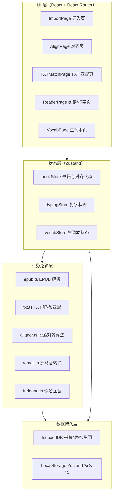

# JP-Typing-Reader 技术文档

> 文档版本：v1.0  
> 适用范围：项目维护、代码分析、功能扩展、问题排查

---

## 1. 项目概述

**JP-Typing-Reader** 是一款面向日语学习者的 Web 应用，采用"双语对照阅读 + 沉浸式打字练习"模式。用户导入日语原文 EPUB/TXT 与中文译文后，系统通过段落对齐算法建立中日段落映射，随后在阅读页以双栏形式展示，并要求用户以罗马音输入日文原文，完成打字训练。

### 1.1 核心价值

- 边读边打：通过键盘输入罗马音转化为假名/汉字，强化记忆。
- 双语对照：日文原文与中文译文按段落对齐同步展示。
- 注音辅助：汉字自动标注平假名读音，降低阅读门槛。
- 生词巩固：自动收集输入错误的单词，生成个性化生词本。

### 1.2 目标用户

- 初级~中级日语学习者（N5~N2）。
- 轻小说爱好者。
- 希望提升日语打字速度的学习者。

---

## 2. 技术栈与依赖关系

### 2.1 核心技术栈

| 技术 | 版本 | 用途 |
|------|------|------|
| React | 18.3.1 | UI 框架 |
| TypeScript | ~5.8.3 | 类型安全 |
| Vite | 6.3.5 | 构建与开发服务器 |
| Tailwind CSS | 3.4.17 | 原子化样式 |
| Zustand | 5.0.14 | 全局状态管理 |
| jszip | 3.10.1 | EPUB（ZIP）解压缩与解析 |
| idb | 8.0.3 | IndexedDB 异步封装 |
| lucide-react | 0.511.0 | 图标库 |

### 2.2 开发与测试依赖

| 技术 | 版本 | 用途 |
|------|------|------|
| Vitest | 4.1.9 | 单元测试框架 |
| jsdom | 27.0.1 | DOM 测试环境 |
| @testing-library/react | 16.3.2 | React 组件测试工具 |
| ESLint | 9.25.0 + typescript-eslint | 代码静态检查 |

> 注：`epubjs` 已列在 `package.json` 中，但当前实现主要使用 `jszip` 自研解析逻辑，见 `src/utils/epub.ts`。

---

## 3. 项目架构概述

### 3.1 整体架构图



### 3.2 设计原则

- **单页应用（SPA）**：通过 `react-router-dom` 在 5 个页面间切换。
- **无后端**：所有数据在浏览器端处理与持久化。
- **状态集中管理**：书籍、打字、生词三大状态分别由 Zustand Store 维护。
- **工具函数与 UI 分离**：解析、对齐、转换等逻辑统一放在 `src/utils/`。

---

## 4. 代码组织结构

```
JP-Typing-Reader/
├── docs/                          # 技术文档
│   └── technical-documentation.md
├── public/
│   └── favicon.svg
├── src/
│   ├── pages/                     # 页面组件
│   │   ├── ImportPage.tsx         # 双 EPUB 导入
│   │   ├── AlignPage.tsx          # EPUB 段落对齐调整
│   │   ├── TXTMatchPage.tsx       # TXT 文件段落匹配
│   │   ├── ReaderPage.tsx         # 阅读与打字练习
│   │   └── VocabPage.tsx          # 生词本
│   ├── stores/                    # Zustand Store
│   │   ├── bookStore.ts
│   │   ├── typingStore.ts
│   │   └── vocabStore.ts
│   ├── utils/                     # 业务逻辑工具
│   │   ├── epub.ts                # EPUB 解析
│   │   ├── txt.ts                 # TXT 解析与匹配
│   │   ├── aligner.ts             # 段落对齐算法
│   │   ├── romaji.ts              # 罗马音转假名
│   │   ├── furigana.ts            # 汉字注音
│   │   ├── database.ts            # IndexedDB 操作
│   │   └── *.test.ts              # 单元测试
│   ├── types/                     # TypeScript 类型定义
│   │   └── index.ts
│   ├── test/
│   │   └── setup.ts               # 测试环境 polyfill
│   ├── App.tsx                    # 路由根组件
│   ├── main.tsx                   # 应用入口
│   └── index.css                  # 全局样式 + Tailwind
├── .trae/documents/               # PRD 与原始架构文档
│   ├── PRD.md
│   └── TECH_ARCH.md
├── package.json
├── tsconfig.json
├── vite.config.ts
├── vitest.config.ts
├── tailwind.config.js
├── postcss.config.js
├── eslint.config.js
└── index.html
```

---

## 5. 数据模型定义

全部数据类型集中定义在 `src/types/index.ts`：

```typescript
// 书籍相关
export interface Chapter {
  id: string;
  title: string;
  content: string;
  order: number;
}

export interface EPUBBook {
  id: string;
  title: string;
  author: string;
  language: 'ja' | 'zh';
  chapters: Chapter[];
  addedAt: number;
}

// 对齐相关
export interface AlignmentPair {
  jpIndex: number;
  zhIndex: number;
  score: number;
}

// 打字相关
export interface Token {
  surface: string;
  reading: string;
  pos: string;
}

export interface RubyText {
  kanji: string;
  furigana: string;
}

export interface TypingState {
  currentCharIndex: number;
  inputBuffer: string;
  typedText: string;
  remainingText: string;
  isCorrect: boolean;
  errors: number;
  startTime: number | null;
}

// 生词本
export interface VocabEntry {
  id: string;
  word: string;
  reading: string;
  wrongCount: number;
  lastWrongAt: number;
  bookmarked: boolean;
}

// 阅读进度
export interface ReadingProgress {
  chapterId: string;
  charIndex: number;
  completed: boolean;
}
```

---

## 6. 核心功能模块说明

### 6.1 EPUB 解析模块（`src/utils/epub.ts`）

#### 职责

- 读取 EPUB 文件（ZIP 格式）。
- 解析 `META-INF/container.xml` 定位 OPF。
- 解析 OPF 中的 `manifest` 与 `spine`，按阅读顺序提取章节。
- 将 HTML 内容去标签、解码实体，得到纯文本。
- 当 spine 无法提取章节时，兜底扫描所有 `.xhtml`/`.html` 文件。

#### 关键函数

| 函数 | 签名 | 说明 |
|------|------|------|
| `parseEPUB` | `(file: File) => Promise<EPUBBook>` | 主入口 |
| `isValidEPUB` | `(file: File) => Promise<boolean>` | 仅校验文件扩展名与 `container.xml` |
| `splitToParagraphs` | `(text: string) => string[]` | 按空行分割并过滤无意义段落 |
| `getChapterPreview` | `(text: string, maxLength?: number) => string` | 章节内容预览 |

#### 解析流程

1. `File.arrayBuffer()` → `JSZip.loadAsync()`。
2. 读取 `META-INF/container.xml`，正则匹配 `full-path="..."` 得到 OPF 路径。
3. 读取 OPF，分别用正则提取 `<item>` 的 `id` 与 `href`（支持任意属性顺序、URL 解码）。
4. 提取 `<itemref idref="...">` 得到 spine 顺序。
5. 通过 `resolveEPUBPath(opfDir, href)` 计算 ZIP 内真实路径，读取内容文件。
6. `detectContentType` 识别图片/目录/前言/后记，跳过非正文内容。
7. `extractTextFromHtml` 去除脚本、样式、图片标签，将块级标签替换为换行，最终得到纯文本。
8. 若 `chapters.length === 0`，调用 `extractChaptersFromFiles` 扫描所有 HTML 文件作为兜底。

### 6.2 TXT 解析与匹配模块（`src/utils/txt.ts`）

#### 职责

- 多编码读取 TXT 文件（UTF-8、GBK、GB2312、Big5）。
- 将 TXT 按空行分割为段落并过滤无效段落。
- 提供 `TXTParagraphMatcher` 实现中日段落自动匹配。
- 支持将 TXT 包装为 `EPUBBook`，供阅读页使用。

#### 关键函数/类

| 名称 | 说明 |
|------|------|
| `readTXTFileWithEncoding` | 自动尝试多种编码读取 TXT |
| `parseTXTToParagraphs` | 段落分割与过滤 |
| `TXTParagraphMatcher` | 多策略段落匹配器 |
| `createBookFromTXT` | 由 TXT 文本生成 `EPUBBook` |
| `exportAlignmentsToJSON` / `importAlignmentsFromJSON` | 对齐结果导入导出 |

#### 匹配策略（`TXTParagraphMatcher.match`）

1. **精确匹配**：清洗标点后文本完全一致。
2. **长度比例匹配**：中文长度 / 日文长度在 `[0.9, 3.5]` 之间且综合评分 ≥ 55。
3. **关键词匹配**：连续汉字或片假名关键词命中。
4. **汉字匹配**：共享独立汉字数 ≥ `min(2, jpKanji.length)`。
5. **贪心匹配**：为剩余日文段落找最佳中文段落，阈值 10。
6. **顺序匹配**：仍无法匹配时按顺序一一对应，兜底分值为 5。

评分维度包括长度比例、标点重合、关键词重合、汉字密度差异。

### 6.3 段落对齐算法（`src/utils/aligner.ts`）

#### 职责

为 EPUB 导入流程提供段落对齐能力，被 `ImportPage` 与 `AlignPage` 调用。

#### 算法流程

1. 提取文本特征：长度、汉字数、平假名数、片假名数、标点数、是否含数字/片假名。
2. 依次执行 8 层策略：精确匹配、长度比例、标点、数字、关键词、汉字、贪心、顺序匹配。
3. 每层维护 `usedJp` / `usedZh`，避免重复匹配。
4. 最终按 `jpIndex` 排序返回 `AlignmentPair[]`。

### 6.4 罗马音转换模块（`src/utils/romaji.ts`）

#### 职责

将用户输入的罗马音实时转换为平假名，并校验输入字符是否合法。

#### 关键函数

| 函数 | 说明 |
|------|------|
| `romajiToHiraganaConvert(romaji: string)` | 罗马音 → 平假名 |
| `isValidRomaji(char: string)` | 仅允许 a-z 与长音 `-` |

#### 转换规则

- 基础音：2 字符子音 + 母音。
- 拗音：3 字符组合（如 `kya`、`shu`）。
- 拨音 `n`：当后续字符不存在或不是元音时输出 `ん`。
- 促音 `っ`：连续两个可促音化辅音时输出 `っ`。
- 长音 `-` 输出 `ー`。

### 6.5 注音模块（`src/utils/furigana.ts`）

#### 职责

为日文文本中的汉字、片假名生成 `<ruby>` 注音数据。

#### 实现要点

- 维护常用汉字读音表 `commonKanjiReadings`（单字及少量词汇）。
- 片假名通过 `katakanaToHiragana` 映射自动转为平假名。
- `simpleTokenize` 按字符类型（汉字/平假名/片假名/其他）切分。
- 对连续汉字序列使用最长匹配查找已知词，未命中则按单字输出（无读音）。
- `addFurigana` 返回 `RubyText[]`，由阅读页渲染为 `<ruby><rt>`。

---

## 7. 状态管理

### 7.1 `bookStore.ts`（书籍与对齐状态）

使用 `zustand` + `persist` 中间件持久化到 LocalStorage。

```typescript
interface BookState {
  jpBook: EPUBBook | null;
  zhBook: EPUBBook | null;
  alignments: AlignmentPair[];
  skippedJp: number[];
  skippedZh: number[];
  currentChapterIndex: number;
  progress: Record<string, number>;

  setJPBook: (book: EPUBBook | null) => Promise<void>;
  setZHBook: (book: EPUBBook | null) => Promise<void>;
  loadBook: (id: string, type: 'jp' | 'zh') => Promise<void>;
  setAlignments: (alignments: AlignmentPair[]) => Promise<void>;
  updateAlignment: (jpIndex: number, zhIndex: number) => void;
  setSkippedJp/Jp: (indices: number[]) => void;
  toggleSkipJp/Zh: (index: number) => void;
  setCurrentChapter: (index: number) => void;
  setProgress: (chapterId: string, charIndex: number) => void;
  reset: () => void;
}
```

重要行为：

- `setJPBook(null)` / `setZHBook(null)` 会清空对应状态，且不再尝试写入 IndexedDB。
- `setAlignments` 会同时把对齐结果写入 IndexedDB（键为 `${jpBookId}_${zhBookId}`）。

### 7.2 `typingStore.ts`（打字状态）

管理单次打字会话：当前文本、已输入、剩余文本、错误数、开始时间。

```typescript
interface TypingStore extends ExtendedTypingState {
  startTyping: (text: string, startIndex?: number) => void;
  processInput: (char: string) => { success: boolean; isComplete: boolean };
  backspace: () => void;
  reset: () => void;
  setActive: (active: boolean) => void;
}
```

- `startTyping` 初始化状态并记录 `startTime`。
- `processInput` 比较输入字符与 `remainingText[0]`，更新状态并返回是否完成。
- `backspace` 删除最后一个已输入字符。

### 7.3 `vocabStore.ts`（生词本状态）

```typescript
interface VocabStore {
  wrongWords: VocabEntry[];
  bookmarkedWords: string[];
  addWrongWord: (word: string, reading: string) => void;
  removeWrongWord: (id: string) => void;
  incrementWrongCount: (id: string) => void;
  toggleBookmark: (id: string) => void;
  exportToCSV: () => string;
  clearAll: () => void;
}
```

持久化到 LocalStorage。`exportToCSV` 生成 UTF-8 CSV 文件。

---

## 8. 路由设计

路由定义在 `src/App.tsx`：

| 路径 | 页面 | 功能 |
|------|------|------|
| `/` | `ImportPage` | 导入双 EPUB |
| `/align` | `AlignPage` | EPUB 段落对齐调整 |
| `/txt-match` | `TXTMatchPage` | TXT 段落匹配与手动对齐 |
| `/read` | `ReaderPage` | 阅读与打字练习 |
| `/vocab` | `VocabPage` | 生词本 |

### 8.1 页面流转

1. **EPUB 流程**：`ImportPage` → 自动对齐 → `AlignPage`（可选手动调整）→ `ReaderPage`。
2. **TXT 流程**：`ImportPage` → `TXTMatchPage`（自动/手动匹配）→ `ReaderPage`。
3. **阅读中**：`ReaderPage` → `/vocab` 查看生词本。

---

## 9. 数据持久化

### 9.1 IndexedDB Schema

数据库名：`jp-typing-reader`，版本：1。

| 对象存储 | 键 | 值 | 说明 |
|----------|-----|-----|------|
| `books` | `id` | `EPUBBook` | 日语/中文书籍 |
| `alignments` | `bookPairId` | `{ bookPairId, pairs, updatedAt }` | 对齐结果 |
| `vocab` | `id` | `VocabEntry` | 生词条目 |

索引：

- `books`：`by-addedAt`
- `vocab`：`by-wrongCount`、`by-lastWrongAt`

### 9.2 LocalStorage 用途

Zustand `persist` 中间件将以下状态写入 LocalStorage：

- `jp-typing-book-store`：`jpBook`、`zhBook`、`alignments`、`skippedJp/Zh`、`currentChapterIndex`、`progress`。
- `jp-typing-vocab-store`：`wrongWords`、`bookmarkedWords`。

---

## 10. 配置说明

### 10.1 `vite.config.ts`

```typescript
export default defineConfig({
  build: { sourcemap: 'hidden' },
  plugins: [
    react({ babel: { plugins: ['react-dev-locator'] } }),
    traeBadgePlugin({ ... }),
    tsconfigPaths(),
  ],
});
```

- `vite-plugin-trae-solo-badge`：仅用于 Solo Badge 展示，可按需移除。
- `vite-tsconfig-paths`：支持 `@/*` 路径别名。

### 10.2 `tsconfig.json`

- `baseUrl: "./"`，路径别名 `@/*` → `./src/*`。
- `strict: false`：当前项目未启用严格模式。
- `moduleResolution: "bundler"`，`noEmit: true`。

### 10.3 `tailwind.config.js`

- 内容扫描范围：`./index.html`、`./src/**/*.{js,ts,jsx,tsx}`。
- 自定义颜色：`indigo-900`、`cream-50`、`sakura-400`、`ink-900/700`。
- 自定义字体：`noto-serif`、`noto-sans`、`mono`。
- 自定义动画：`bounce-correct`、`shake-error`、`fade-in`/`fadeIn`。

### 10.4 `vitest.config.ts`

- 测试环境：`jsdom`。
- `globals: true`。
- `setupFiles: ['./src/test/setup.ts']`：注入 `matchMedia`、`ResizeObserver`、`IntersectionObserver` 的 mock。
- 覆盖率阈值：lines/functions/branches/statements 均 ≥ 80%。

### 10.5 `eslint.config.js`

- 使用 `@eslint/js`、`typescript-eslint`、`react-hooks`、`react-refresh`。
- 忽略 `dist`、`coverage`。
- 关闭 `no-useless-escape` 与 `no-control-regex`，避免日语正则误报。

---

## 11. 关键算法与实现逻辑

### 11.1 EPUB 路径解析

```typescript
function resolveEPUBPath(opfDir: string, href: string): string {
  const parts = (opfDir ? `${opfDir}/${href}` : href).split('/');
  const resolved: string[] = [];
  for (const part of parts) {
    if (part === '' || part === '.') continue;
    if (part === '..') resolved.pop();
    else resolved.push(part);
  }
  return resolved.join('/');
}
```

支持相对路径段 `..`、当前目录 `.`，并会忽略空段。

### 11.2 段落过滤策略

`splitToParagraphs` / `parseTXTToParagraphs` 会过滤以下无效段落：

- 仅包含标点的段落。
- 仅包含数字与标点的段落。
- 仅包含罗马数字或中文数字的段落。
- 仅含 0~1 个日文字符的段落。
- 仅含空白字符的段落。

### 11.3 阅读页对齐映射

`ReaderPage` 不再默认中日段落同索引对应，而是根据 `alignments` 构建 `alignmentMap`：

```typescript
const alignmentMap = useMemo(() => {
  const map = new Map<number, number>();
  alignments.forEach((a) => map.set(a.jpIndex, a.zhIndex));
  return map;
}, [alignments]);

const currentZhParagraph = alignmentMap.has(currentParagraphIndex)
  ? zhParagraphs[alignmentMap.get(currentParagraphIndex)!] || ''
  : '';
```

未匹配段落显示占位提示，但仍可进行打字练习，实现"部分匹配即可启动"。

### 11.4 打字输入处理

`ReaderPage` 监听全局 `keydown`：

1. 若打字未开始，调用 `startTyping(currentJpParagraph)`。
2. `Backspace`：触发 `backspace()` 并清空输入缓冲。
3. `Space` / 全角空格：确认当前输入缓冲（目前仅做罗马音转换展示）。
4. 单字符罗马音：追加到缓冲并调用 `processInput`，若返回 `isComplete` 则在 500ms 后进入下一段。

---

## 12. API 接口规范

本项目无外部 REST API。内部模块通过函数签名与 Zustand Store 交互。

### 12.1 内部核心 API

| 模块 | 函数/类 | 输入 | 输出 | 说明 |
|------|---------|------|------|------|
| `epub` | `parseEPUB(file)` | `File` | `Promise<EPUBBook>` | 解析 EPUB |
| `epub` | `splitToParagraphs(text)` | `string` | `string[]` | 段落分割 |
| `txt` | `readTXTFileWithEncoding(file)` | `File` | `Promise<{text, encoding}>` | 多编码读取 |
| `txt` | `parseTXTToParagraphs(text)` | `string` | `string[]` | TXT 段落分割 |
| `txt` | `new TXTParagraphMatcher(jp, zh)` | 两字符串 | matcher 实例 | 段落匹配 |
| `txt` | `createBookFromTXT(text, lang, filename?)` | `string, 'ja'|'zh', string?` | `EPUBBook` | 包装为书籍 |
| `aligner` | `alignParagraphs(jp, zh)` | `string[], string[]` | `AlignmentPair[]` | 对齐算法 |
| `romaji` | `romajiToHiraganaConvert(romaji)` | `string` | `string` | 罗马音转假名 |
| `furigana` | `addFurigana(text)` | `string` | `RubyText[]` | 生成注音 |
| `database` | `saveBook(book)` | `EPUBBook` | `Promise<void>` | 写入书籍 |
| `database` | `saveAlignments(jpId, zhId, pairs)` | ... | `Promise<void>` | 写入对齐结果 |
| `database` | `getBook(id)` / `getAlignments(...)` | ... | `Promise<...>` | 读取 |

---

## 13. 开发与部署流程

### 13.1 开发环境启动

```bash
npm install
npm run dev
```

默认访问 `http://localhost:5173`。

### 13.2 常用命令

| 命令 | 作用 |
|------|------|
| `npm run dev` | 开发服务器 |
| `npm run build` | TypeScript 编译 + Vite 生产构建 |
| `npm run preview` | 预览生产构建 |
| `npm run check` | TypeScript 类型检查（无输出） |
| `npm run lint` | ESLint 检查 |
| `npm test` | 运行单元测试 |
| `npm run test:coverage` | 运行测试并生成覆盖率报告 |

### 13.3 部署

1. 执行 `npm run build`，产物位于 `dist/`。
2. `dist/` 为纯静态文件，可部署到任意静态托管服务（Vercel、Netlify、GitHub Pages、Nginx 等）。
3. 由于使用 `BrowserRouter`，服务器需配置所有路由回退到 `index.html`。

---

## 14. 测试策略

- **单元测试**：覆盖 `epub.ts`、`txt.ts`、`romaji.ts`、`furigana.ts` 的核心函数。
- **测试框架**：Vitest + jsdom + `@testing-library/react`。
- **覆盖率**：配置 thresholds 为 80%（lines/functions/branches/statements）。
- **测试辅助**：`src/test/setup.ts` 提供浏览器 API 的 mock。

运行测试：

```bash
npm test
npm run test:coverage
```

---

## 15. 常见问题与解决方案

### 15.1 EPUB 解析为 0 段落

**原因**：部分 EPUB 的 spine 配置异常，或 `href` 使用 URL 编码/相对路径。

**解决**：

- `resolveEPUBPath` 处理相对路径与 `..`。
- `decodeURIComponent(hrefMatch[1])` 解码 URL 编码。
- `extractChaptersFromFiles` 在 spine 无效时扫描所有 HTML 文件兜底。

### 15.2 TXT 自动匹配按钮无响应

**原因**：大文件匹配为同步计算，阻塞主线程，UI 来不及更新；或段落为空。

**解决**：

- `handleAutoMatch` 改为 `async`，先 `await new Promise((resolve) => setTimeout(resolve, 0))` 让 React 渲染 loading 状态。
- 增加 `getJpParagraphCount() === 0` 等前置校验并给出提示。

### 15.3 手动匹配时一个中文段落被多次日文段落关联

**原因**：原逻辑仅根据 `jpIndex` 更新，未处理 `zhIndex` 重复。

**解决**：在创建新关联前，先过滤掉 `jpIndex` 或 `zhIndex` 冲突的旧关联，保证一对一。

### 15.4 部分匹配后无法开始阅读

**原因**：原 `ReaderPage` 默认中日段落同索引显示，未使用 `alignments`。

**解决**：`ReaderPage` 构建 `alignmentMap`，未匹配段落显示占位文本，已匹配段落正常显示翻译，从而支持部分匹配启动打字。

### 15.5 生词本未持久化

**原因**：未正确配置 Zustand `persist`。

**解决**：`vocabStore` 已使用 `persist` 中间件，名称为 `jp-typing-vocab-store`。

---

## 16. 扩展建议

1. **真正的日语分词**：当前 `furigana.ts` 使用静态字典，建议引入 `kuromoji.js` 进行在线分词与读音推断。
2. **多章节对齐**：当前 `alignments` 是全局索引，跨章节时可能错位；可在 `AlignmentPair` 中增加 `chapterIndex` 字段。
3. **阅读进度细化**：当前 `setProgress` 仅记录章节级字符位置，可细化到段落与字符索引。
4. **Web Worker**：大文件匹配/大文本解析可放入 Worker，避免 UI 卡顿。
5. **设置页**：新增字体大小、主题、注音开关等全局设置。

---

## 17. 参考文档

- [README.md](file:///d:/Person/GPNU/JP-Typing-Reader/JP-Typing-Reader/README.md)
- [PRD.md](file:///d:/Person/GPNU/JP-Typing-Reader/JP-Typing-Reader/.trae/documents/PRD.md)
- [原始 TECH_ARCH.md](file:///d:/Person/GPNU/JP-Typing-Reader/JP-Typing-Reader/.trae/documents/TECH_ARCH.md)
- [React 官方文档](https://react.dev/)
- [Vite 官方文档](https://vitejs.dev/)
- [Tailwind CSS 官方文档](https://tailwindcss.com/)
- [Zustand 官方文档](https://zustand.docs.pmnd.rs/)
- [idb 文档](https://github.com/jakearchibald/idb)
